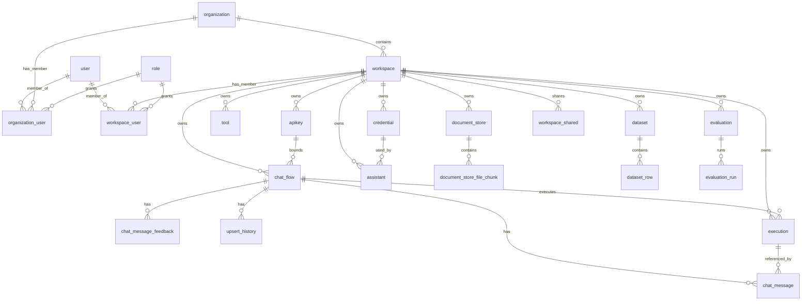

# SciAgent 数据库表结构说明（基于 TypeORM Entities 与迁移脚本）

本文档根据 `packages/server/src/database/entities`、`packages/server/src/enterprise/database/entities` 与迁移脚本整理，目标是解释**所有表**的用途、字段含义、与功能模块的关联、以及表间关系。

> 说明
>
> -   **真实表名**以迁移脚本创建的 snake_case 为准（例如 `ChatFlow` 对应 `chat_flow`）。少数表使用 `@Entity('xxx')` 显式指定（例如 `apikey`、`custom_template`、`workspace_user`）。
> -   多数“复杂字段”以 **JSON 字符串**形式存储在 `text` 列（例如 `flowData`、`executionData`、`details`、`loaders`、`metrics` 等）。
> -   代码中有一些仅以 `xxxId` 字段表达关联，但未在 Entity 上声明外键约束；文档会把它们视为**逻辑外键**。

---

## 全局约定与通用字段

-   **`id`**：多数表使用 `uuid` 主键（`@PrimaryGeneratedColumn('uuid')`）。少数表使用自然/自定义主键（例如 `apikey.id` 为 20 位字符串；`login_sessions.sid` 为字符串）。
-   **`workspaceId`**：贯穿几乎所有业务表的租户隔离字段。绝大部分查询/列表接口都会按 `workspaceId` 过滤（见各 `services/*`）。
-   **`createdDate` / `updatedDate`**：审计时间字段。部分表只有 `createdDate`。
-   **JSON 文本列**：`text` 中存储 JSON（或 JSON 数组），上层服务会 `JSON.parse/JSON.stringify`；这类字段变更往往通过迁移脚本演进。

---

## 核心业务表（开源核心）

### 1) `chat_flow`（对话流/AgentFlow 定义）

-   **对应实体**：`ChatFlow`（`packages/server/src/database/entities/ChatFlow.ts`）
-   **相关功能**：
    -   Chatflow/Agentflow 的创建、查询、发布与删除：`packages/server/src/services/chatflows/index.ts`
    -   运行时可能会按 `apikeyid` 绑定访问：同上
    -   与文档库使用关系维护：`packages/server/src/services/documentstore/index.ts`（`whereUsed`）
-   **主键**：`id` (uuid)
-   **字段说明**：
    -   **`name`**：流程名称（列表、搜索、展示用）。
    -   **`flowData`**：流程图完整定义（ReactFlow 结构 JSON 字符串，包含 nodes/edges 等）。
    -   **`deployed`**：是否部署（用于 UI/运行态区分）。
    -   **`isPublic`**：是否公开（与分享/公开访问相关）。
    -   **`apikeyid`**：绑定的 API Key ID（逻辑外键 → `apikey.id`），用于“仅允许某 Key 访问/列出”。
    -   **`chatbotConfig`**：聊天机器人配置（JSON 字符串；流式输出可用性、后处理等会读取）。
    -   **`apiConfig`**：API 层配置（JSON 字符串；例如暴露接口/鉴权等配置）。
    -   **`analytic`**：分析/埋点相关配置（JSON 字符串）。
    -   **`speechToText` / `textToSpeech`**：语音能力配置（JSON 字符串）。
    -   **`followUpPrompts`**：自动追问提示配置（JSON 字符串）。
    -   **`category`**：分类标签（用于筛选/组织）。
    -   **`type`**：流程类型（`CHATFLOW | AGENTFLOW | MULTIAGENT | ASSISTANT`）。
    -   **`createdDate` / `updatedDate`**：创建/更新时间。
    -   **`workspaceId`**：所属工作区（逻辑外键 → `workspace.id`）。
-   **关系**：
    -   1:N `chat_flow` → `chat_message`（`chat_message.chatflowid`）
    -   1:N `chat_flow` → `chat_message_feedback`（`chat_message_feedback.chatflowid`）
    -   1:N `chat_flow` → `upsert_history`（`upsert_history.chatflowid`）
    -   1:N `chat_flow` → `execution`（`execution.agentflowId`，当 `type=AGENTFLOW` 时常见）
-   **索引/查询特征**：
    -   服务层经常按 `updatedDate` 排序，按 `type`、`workspaceId` 过滤。

---

### 2) `chat_message`（聊天消息/对话记录）

-   **对应实体**：`ChatMessage`（`packages/server/src/database/entities/ChatMessage.ts`）
-   **相关功能**：消息写入/读取/删除、按条件过滤、删除时清理上传文件：`packages/server/src/services/chat-messages/index.ts`
-   **主键**：`id` (uuid)
-   **字段说明**：
    -   **`role`**：消息角色（用户/助手/系统等，枚举 `MessageType`）。
    -   **`chatflowid`**：所属流程（逻辑外键 → `chat_flow.id`），并有索引（高频过滤字段）。
    -   **`executionId`**：关联一次执行记录（逻辑外键 → `execution.id`），并在实体中声明 `OneToOne` 关系用于联表读取。
    -   **`content`**：消息正文（文本）。
    -   **`sourceDocuments`**：引用的来源文档（JSON 字符串，常用于 RAG 引用展示）。
    -   **`usedTools`**：工具调用信息（JSON 字符串）。
    -   **`fileAnnotations`**：文件标注信息（JSON 字符串）。
    -   **`agentReasoning`**：推理/思考过程（如启用记录，JSON/文本）。
    -   **`fileUploads`**：上传文件信息（JSON 字符串；删除消息会尝试清理存储）。
    -   **`artifacts`**：生成产物信息（JSON 字符串）。
    -   **`action`**：消息动作/命令类字段（可为 `null`）。
    -   **`chatType`**：会话类型（如 internal/public 等，上层枚举 `ChatType`）。
    -   **`chatId`**：会话 ID（字符串；同一 `chatflowid` 下聚合同一会话）。
    -   **`memoryType`**：记忆类型（用于消息检索/上下文策略）。
    -   **`sessionId`**：会话 session（常与运行/评估联动）。
    -   **`createdDate`**：创建时间。
    -   **`leadEmail`**：线索邮箱（与 `lead`/线索收集联动）。
    -   **`followUpPrompts`**：追问提示（JSON 字符串）。
-   **关系**：
    -   N:1 `chat_message` → `chat_flow`（通过 `chatflowid`）
    -   0..1:1 `chat_message` → `execution`（通过 `executionId`）
-   **索引/查询特征**：
    -   `chatflowid` 有索引；服务层大量按 `chatflowid` + `chatId/sessionId` + 时间范围过滤。

---

### 3) `chat_message_feedback`（消息反馈/评分）

-   **对应实体**：`ChatMessageFeedback`（`packages/server/src/database/entities/ChatMessageFeedback.ts`）
-   **相关功能**：消息反馈读写、删除消息时联动删除反馈：`packages/server/src/services/chat-messages/index.ts`
-   **主键**：`id` (uuid)
-   **唯一约束**：`messageId` 唯一（同一消息仅允许一条反馈记录）
-   **字段说明**：
    -   **`chatflowid`**：所属流程（逻辑外键 → `chat_flow.id`，有索引）。
    -   **`chatId`**：会话 ID（有索引；便于按会话删除/筛选反馈）。
    -   **`messageId`**：消息 ID（逻辑外键 → `chat_message.id`，并要求唯一）。
    -   **`rating`**：评分类型（如 thumbs up/down 等，枚举 `ChatMessageRatingType`）。
    -   **`content`**：反馈补充文本（可选）。
    -   **`createdDate`**：创建时间。
-   **关系**：
    -   逻辑上 N:1 → `chat_message`（通过 `messageId`）
    -   逻辑上 N:1 → `chat_flow`（通过 `chatflowid`）

---

### 4) `credential`（凭据/密钥存储）

-   **对应实体**：`Credential`（`packages/server/src/database/entities/Credential.ts`）
-   **相关功能**：
    -   凭据创建/读取/更新/删除、解密返回：`packages/server/src/services/credentials/index.ts`
    -   工作区共享：通过 `workspace_shared`（企业能力，见下文）
-   **主键**：`id` (uuid)
-   **字段说明**：
    -   **`name`**：用户可读名称（列表展示）。
    -   **`credentialName`**：凭据类型/组件名（用于在 nodesPool 中匹配解密与字段结构）。
    -   **`encryptedData`**：加密后的凭据内容（密文；服务层会解密后返回 `plainDataObj`，但通常不会直接返回此字段）。
    -   **`createdDate` / `updatedDate`**：创建/更新时间。
    -   **`workspaceId`**：所属工作区。
-   **关系**：
    -   1:N `credential` 可被 `assistant.credential` 引用（逻辑外键，见 `assistant`）。
    -   可被共享：`workspace_shared.sharedItemId` + `itemType='credential'`。
-   **安全注意**：
    -   `encryptedData` 属于敏感字段，API 通常会 `omit`。

---

### 5) `tool`（自定义工具定义）

-   **对应实体**：`Tool`（`packages/server/src/database/entities/Tool.ts`）
-   **相关功能**：自定义工具/函数 schema 管理（被运行/智能体调用）
-   **主键**：`id` (uuid)
-   **字段说明**：
    -   **`name`**：工具名称。
    -   **`description`**：工具描述（用于 UI/提示词）。
    -   **`color`**：UI 色值。
    -   **`iconSrc`**：图标资源地址（可选）。
    -   **`schema`**：工具输入输出 schema（JSON 字符串，常用于函数调用规范）。
    -   **`func`**：工具实现/函数体（文本；可能为代码片段或可执行定义）。
    -   **`createdDate` / `updatedDate`**：审计时间。
    -   **`workspaceId`**：所属工作区。

---

### 6) `assistant`（Assistant 定义/外部助手绑定）

-   **对应实体**：`Assistant`（`packages/server/src/database/entities/Assistant.ts`）
-   **相关功能**：OpenAI Assistants/自定义助手的创建与管理：`packages/server/src/services/assistants/index.ts`
-   **主键**：`id` (uuid)
-   **字段说明**：
    -   **`details`**：助手完整配置（JSON 字符串；包含模型、指令、工具、tool_resources 等）。
    -   **`credential`**：用于访问外部提供方的凭据 ID（逻辑外键 → `credential.id`）。
    -   **`iconSrc`**：图标（可选）。
    -   **`type`**：助手类型（如 `CUSTOM` 或外部提供方类型，枚举 `AssistantType`）。
    -   **`createdDate` / `updatedDate`**：审计时间。
    -   **`workspaceId`**：所属工作区。
-   **关系**：
    -   N:1（逻辑）`assistant.credential` → `credential.id`

---

### 7) `variable`（工作区变量/密钥映射）

-   **对应实体**：`Variable`（`packages/server/src/database/entities/Variable.ts`）
-   **相关功能**：运行时变量注入、流程配置引用（由服务层按工作区管理）
-   **主键**：`id` (uuid)
-   **字段说明**：
    -   **`name`**：变量名（通常用于在 flowData 中引用）。
    -   **`value`**：变量值（文本；可为空）。
    -   **`type`**：变量类型（默认 `'string'`，用于 UI/校验）。
    -   **`createdDate` / `updatedDate`**：审计时间。
    -   **`workspaceId`**：所属工作区。

---

### 8) `document_store`（文档库/知识库）

-   **对应实体**：`DocumentStore`（`packages/server/src/database/entities/DocumentStore.ts`）
-   **相关功能**：文档加载、切分、向量化、检索、与 chatflow 的使用关系：`packages/server/src/services/documentstore/index.ts`
-   **主键**：`id` (uuid)
-   **字段说明**：
    -   **`name`**：文档库名称。
    -   **`description`**：描述（可选）。
    -   **`loaders`**：已配置的数据源/加载器列表（JSON 字符串；包含 docId、文件列表、状态等）。
    -   **`whereUsed`**：被哪些 chatflow 使用（JSON 数组字符串，存 `chat_flow.id` 列表；服务层会反查名字）。
    -   **`status`**：文档库状态（枚举 `DocumentStoreStatus`）。
    -   **`vectorStoreConfig`**：向量库配置（JSON 字符串/可空）。
    -   **`embeddingConfig`**：Embedding 配置（JSON 字符串/可空）。
    -   **`recordManagerConfig`**：记录管理器配置（JSON 字符串/可空）。
    -   **`createdDate` / `updatedDate`**：审计时间。
    -   **`workspaceId`**：所属工作区。
-   **关系**：
    -   1:N `document_store` → `document_store_file_chunk`（通过 `storeId`）
    -   与 `chat_flow` 为“多对多（逻辑）”：通过 `whereUsed` JSON 列维护，而非中间表。

---

### 9) `document_store_file_chunk`（文档切分块）

-   **对应实体**：`DocumentStoreFileChunk`（`packages/server/src/database/entities/DocumentStoreFileChunk.ts`）
-   **相关功能**：文档预览/分页、删除 loader 时清理 chunks：`packages/server/src/services/documentstore/index.ts`
-   **主键**：`id` (uuid)
-   **字段说明**：
    -   **`docId`**：loader/doc 的 ID（来自 `document_store.loaders` 内某条 loader 的 `id`；有索引）。
    -   **`storeId`**：所属文档库（逻辑外键 → `document_store.id`；有索引）。
    -   **`chunkNo`**：切分序号。
    -   **`pageContent`**：chunk 文本内容。
    -   **`metadata`**：chunk 元数据（JSON 字符串，可选）。
-   **关系**：
    -   N:1（逻辑）→ `document_store`（`storeId`）

---

### 10) `dataset`（评测数据集）

-   **对应实体**：`Dataset`（`packages/server/src/database/entities/Dataset.ts`）
-   **相关功能**：数据集管理、CSV 导入、与评测绑定：`packages/server/src/services/dataset/index.ts`
-   **主键**：`id` (uuid)
-   **字段说明**：
    -   **`name`**：数据集名称。
    -   **`description`**：描述。
    -   **`createdDate` / `updatedDate`**：审计时间。
    -   **`workspaceId`**：所属工作区。
-   **关系**：
    -   1:N `dataset` → `dataset_row`（`dataset_row.datasetId`）
    -   1:N `dataset` → `evaluation`（`evaluation.datasetId`）

---

### 11) `dataset_row`（数据集行）

-   **对应实体**：`DatasetRow`（`packages/server/src/database/entities/DatasetRow.ts`）
-   **相关功能**：数据集内容（输入/期望输出）、排序、增删改：`packages/server/src/services/dataset/index.ts`
-   **主键**：`id` (uuid)
-   **字段说明**：
    -   **`datasetId`**：所属数据集（逻辑外键 → `dataset.id`，有索引）。
    -   **`input`**：输入（文本；也可能是 JSON 序列化后的对话/结构化输入）。
    -   **`output`**：期望输出（ground truth）。
    -   **`updatedDate`**：更新时间（用于行变更追踪）。
    -   **`sequence_no` / `sequenceNo`**：显示顺序（用于拖拽排序/稳定回放）。
-   **关系**：
    -   N:1（逻辑）→ `dataset`（`datasetId`）

---

### 12) `evaluation`（评测任务/配置）

-   **对应实体**：`Evaluation`（`packages/server/src/database/entities/Evaluation.ts`）
-   **相关功能**：创建评测、触发运行、保存汇总指标：`packages/server/src/services/evaluations/index.ts`
-   **主键**：`id` (uuid)
-   **字段说明**：
    -   **`average_metrics`**：评测汇总指标（JSON 字符串；pass/fail/error、cost 等聚合）。
    -   **`additionalConfig`**：附加配置（JSON 字符串；包含 evaluator 选择、llmConfig、chatflowTypes、datasetAsOneConversation 等）。
    -   **`name`**：评测名称。
    -   **`evaluationType`**：评测类型（例如 `llm` / `simple` 等）。
    -   **`chatflowId`**：被评测的 chatflowId 列表（注意：服务层把它当 JSON 数组字符串使用；字段类型为 `string`）。
    -   **`chatflowName`**：冗余保存的名称（便于展示/历史一致性）。
    -   **`datasetId`**：使用的数据集 ID。
    -   **`datasetName`**：冗余名称。
    -   **`status`**：状态（`PENDING/RUNNING/COMPLETED/...`，见 `EvaluationStatus`）。
    -   **`runDate`**：最近一次运行时间（`UpdateDateColumn`）。
    -   **`workspaceId`**：所属工作区。
-   **关系**：
    -   1:N `evaluation` → `evaluation_run`（`evaluation_run.evaluationId`）
    -   N:1（逻辑）→ `dataset`（`datasetId`）
    -   逻辑上关联多个 `chat_flow`（通过 `chatflowId` JSON 数组）

---

### 13) `evaluation_run`（评测单次运行明细）

-   **对应实体**：`EvaluationRun`（`packages/server/src/database/entities/EvaluationRun.ts`）
-   **相关功能**：保存每条 dataset row 的运行结果、指标、错误：`packages/server/src/services/evaluations/index.ts`
-   **主键**：`id` (uuid)
-   **字段说明**：
    -   **`evaluationId`**：所属评测（逻辑外键 → `evaluation.id`）。
    -   **`input`**：本次运行的输入（文本）。
    -   **`expectedOutput`**：期望输出。
    -   **`actualOutput`**：实际输出（通常为 JSON 数组字符串，因可能多次/多 chatflow）。
    -   **`metrics`**：指标明细（JSON 字符串；可能含 token/cost、嵌套指标等）。
    -   **`llmEvaluators`**：LLM 评估器结果（JSON 字符串）。
    -   **`evaluators`**：附加评估器结果（JSON 字符串）。
    -   **`errors`**：错误信息列表（JSON 字符串）。
    -   **`runDate`**：运行时间（`UpdateDateColumn`）。
-   **关系**：
    -   N:1（逻辑）→ `evaluation`（`evaluationId`）

---

### 14) `evaluator`（评估器配置）

-   **对应实体**：`Evaluator`（`packages/server/src/database/entities/Evaluator.ts`）
-   **相关功能**：保存可复用的 evaluator 配置，被评测流程引用：`packages/server/src/services/evaluations/*`（通过 `evaluatorsService`）
-   **主键**：`id` (uuid)
-   **字段说明**：
    -   **`name`**：评估器名称。
    -   **`type`**：评估器类型（例如 regex、llm-judge 等）。
    -   **`config`**：配置（JSON 字符串）。
    -   **`createdDate` / `updatedDate`**：审计时间。
    -   **`workspaceId`**：所属工作区。

---

### 15) `execution`（AgentFlow 执行记录）

-   **对应实体**：`Execution`（`packages/server/src/database/entities/Execution.ts`）
-   **相关功能**：执行列表/详情/公开链接、状态更新、删除联动清理 `chat_message.executionId`：`packages/server/src/services/executions/index.ts`
-   **主键**：`id` (uuid)
-   **字段说明**：
    -   **`executionData`**：执行过程/节点输出的明细（JSON 字符串；公开访问时会移除 credentialId）。
    -   **`state`**：执行状态（枚举 `ExecutionState`）。
    -   **`agentflowId`**：所属 agentflow（逻辑外键 → `chat_flow.id`，在实体中声明 `ManyToOne` 到 `ChatFlow`；有索引）。
    -   **`sessionId`**：会话/执行分组 ID（有索引；便于按 session 筛选）。
    -   **`action`**：执行动作/触发类型（可选）。
    -   **`isPublic`**：是否公开（用于公开访问执行记录）。
    -   **`createdDate` / `updatedDate`**：审计时间。
    -   **`stoppedDate`**：停止时间（注意：实体中为必填 `@Column()`，但实际写入需留意迁移/默认值）。
    -   **`workspaceId`**：所属工作区。
-   **关系**：
    -   N:1 `execution.agentflowId` → `chat_flow.id`
    -   0..N `chat_message.executionId` → `execution.id`

---

### 16) `apikey`（API Key）

-   **对应实体**：`ApiKey`（`packages/server/src/database/entities/ApiKey.ts`，显式表名 `apikey`）
-   **相关功能**：API Key 管理、权限子集校验、与 chatflow 绑定：`packages/server/src/services/apikey/index.ts`、`packages/server/src/services/chatflows/index.ts`
-   **主键**：`id`（varchar(20)，通常为 UUID/短 ID）
-   **字段说明**：
    -   **`apiKey`**：对外使用的 key（明文）。
    -   **`apiSecret`**：由 key 派生的哈希/校验值（服务端验证/签名用途）。
    -   **`keyName`**：显示名称。
    -   **`permissions`**：权限数组（`simple-json` 存储；服务层会限制不能包含 `workspace:`/`admin:` 等前缀）。
    -   **`updatedDate`**：更新时间。
    -   **`workspaceId`**：所属工作区（并可通过 workspace→organization 统计组织级 keys）。
-   **关系**：
    -   1:N（逻辑）`apikey.id` → `chat_flow.apikeyid`

---

### 17) `custom_template`（自定义模板）

-   **对应实体**：`CustomTemplate`（显式表名 `custom_template`）
-   **相关功能**：模板库、工作区共享（与 `workspace_shared` 联动）
-   **主键**：`id` (uuid)
-   **字段说明**：
    -   **`name`**：模板名。
    -   **`flowData`**：模板流程定义（JSON 字符串）。
    -   **`description`**：描述（可选）。
    -   **`badge`**：徽标/标签（可选）。
    -   **`framework`**：适用框架（可选）。
    -   **`usecases`**：使用场景（可选）。
    -   **`type`**：模板类型（可选）。
    -   **`workspaceId`**：所属工作区。
    -   **`createdDate` / `updatedDate`**：审计时间。
-   **关系**：
    -   可被共享：`workspace_shared.sharedItemId` + `itemType='customTemplate'`（具体 itemType 以服务层约定为准）。

---

### 18) `upsert_history`（向量入库/Upsert 历史）

-   **对应实体**：`UpsertHistory`（`packages/server/src/database/entities/UpsertHistory.ts`）
-   **相关功能**：文档库 upsert 记录与回溯，删除 chatflow 时联动删除：`packages/server/src/services/chatflows/index.ts`、`packages/server/src/services/documentstore/index.ts`
-   **主键**：`id` (uuid)
-   **字段说明**：
    -   **`chatflowid`**：关联流程（逻辑外键 → `chat_flow.id`，有索引）。
    -   **`result`**：入库结果摘要（文本/JSON）。
    -   **`flowData`**：当次入库所用 flowData（用于回溯）。
    -   **`date`**：记录时间（`CreateDateColumn`）。

---

### 19) `lead`（线索收集）

-   **对应实体**：`Lead`（`packages/server/src/database/entities/Lead.ts`）
-   **相关功能**：从聊天中收集潜在客户信息（姓名/邮箱/电话），与特定 chatflow/chatId 关联
-   **主键**：`id` (uuid)
-   **字段说明**：
    -   **`name` / `email` / `phone`**：线索信息。
    -   **`chatflowid`**：来源流程（逻辑外键 → `chat_flow.id`）。
    -   **`chatId`**：来源会话 ID（用于定位对话）。
    -   **`createdDate`**：创建时间。

---

## 企业版组织/工作区/权限相关表（enterprise）

企业表用于多组织、多工作区、RBAC、登录方式与 session 存储等能力。

### 20) `organization`（组织）

-   **对应实体**：`Organization`（`packages/server/src/enterprise/database/entities/organization.entity.ts`）
-   **主键**：`id` (uuid)
-   **字段说明**：
    -   **`name`**：组织名（默认 `Default Organization`）。
    -   **`customerId` / `subscriptionId`**：计费/订阅相关标识（云端/商业化场景）。
    -   **`createdDate` / `updatedDate`**：审计时间。
    -   **`createdBy` / `updatedBy`**：操作者用户 ID（逻辑外键 → `user.id`），并在实体中声明 `ManyToOne`。
-   **关系**：
    -   1:N `organization` → `workspace`（`workspace.organizationId`）
    -   N:M `organization` ↔ `user`（通过 `organization_user`）

---

### 21) `workspace`（工作区）

-   **对应实体**：`Workspace`（`packages/server/src/enterprise/database/entities/workspace.entity.ts`）
-   **相关功能**：工作区生命周期、删除时按依赖顺序清理所有业务表：`packages/server/src/enterprise/services/workspace.service.ts`
-   **主键**：`id` (uuid)
-   **字段说明**：
    -   **`name`**：工作区名（默认 `Personal Workspace`；部分保留名限制）。
    -   **`description`**：描述（可选）。
    -   **`organizationId`**：所属组织（逻辑外键 → `organization.id`，实体声明 `ManyToOne`）。
    -   **`createdDate` / `updatedDate`**：审计时间。
    -   **`createdBy` / `updatedBy`**：操作者用户 ID（逻辑外键 → `user.id`，实体声明 `ManyToOne`）。
-   **关系**：
    -   1:N `workspace` → 各业务表（通过业务表中的 `workspaceId`）
    -   N:M `workspace` ↔ `user`（通过 `workspace_user` 或 `workspace_users`，见下）

---

### 22) `user`（用户）

-   **对应实体**：`User`（`packages/server/src/enterprise/database/entities/user.entity.ts`）
-   **主键**：`id` (uuid)
-   **字段说明**：
    -   **`name`**：用户名。
    -   **`email`**：邮箱（唯一）。
    -   **`credential`**：认证凭据（通常为密码哈希或认证信息，text，可空）。
    -   **`tempToken` / `tokenExpiry`**：邀请/找回/临时 token 机制（token 唯一，可空）。
    -   **`status`**：用户状态（`active/invited/unverified/deleted`）。
    -   **`createdDate` / `updatedDate`**：审计时间。
    -   **`createdBy` / `updatedBy`**：操作者用户 ID（自关联）。
-   **关系**：
    -   N:M `user` ↔ `organization`（`organization_user`）
    -   N:M `user` ↔ `workspace`（`workspace_user`）
    -   1:N `user` → 多类资源的 createdBy/updatedBy（组织、角色、工作区等）

---

### 23) `role`（角色）

-   **对应实体**：`Role`（`packages/server/src/enterprise/database/entities/role.entity.ts`）
-   **主键**：`id` (uuid)
-   **字段说明**：
    -   **`organizationId`**：可选，组织级角色（逻辑外键 → `organization.id`）。
    -   **`name` / `description`**：角色名/描述。
    -   **`permissions`**：权限集合（以 text 保存，常见为 JSON 字符串或分隔字符串，具体由上层约定）。
    -   **`createdDate` / `updatedDate`**：审计时间。
    -   **`createdBy` / `updatedBy`**：操作者用户 ID。
-   **关系**：
    -   1:N `role` → `organization_user.roleId`
    -   1:N `role` → `workspace_user.roleId`

---

### 24) `organization_user`（组织成员关系）

-   **对应实体**：`OrganizationUser`（显式表名 `organization_user`）
-   **主键**：复合主键（`organizationId` + `userId`）
-   **字段说明**：
    -   **`organizationId`**：组织 ID（外键逻辑 → `organization.id`）。
    -   **`userId`**：用户 ID（外键逻辑 → `user.id`）。
    -   **`roleId`**：角色 ID（外键逻辑 → `role.id`）。
    -   **`status`**：成员状态（`active/disable/invited`）。
    -   **`createdDate` / `updatedDate`**：审计时间。
    -   **`createdBy` / `updatedBy`**：操作者用户 ID。
-   **关系**：
    -   N:1 → `organization`
    -   N:1 → `user`
    -   N:1 → `role`

---

### 25) `workspace_user`（工作区成员关系）

-   **对应实体**：`WorkspaceUser`（显式表名 `workspace_user`）
-   **主键**：复合主键（`workspaceId` + `userId`）
-   **字段说明**：
    -   **`workspaceId`**：工作区 ID（→ `workspace.id`）。
    -   **`userId`**：用户 ID（→ `user.id`）。
    -   **`roleId`**：角色 ID（→ `role.id`）。
    -   **`status`**：成员状态（默认 invited）。
    -   **`lastLogin`**：最后登录时间（当前使用 `CreateDateColumn()`，语义上更像时间戳字段，需以服务层实际写入为准）。
    -   **`createdDate` / `updatedDate`**：审计时间。
    -   **`createdBy` / `updatedBy`**：操作者用户 ID。
-   **关系**：
    -   N:1 → `workspace`
    -   N:1 → `user`
    -   N:1 → `role`

---

### 26) `login_method`（登录方式/SSO 配置）

-   **对应实体**：`LoginMethod`（显式表名 `login_method`）
-   **主键**：`id` (uuid)
-   **字段说明**：
    -   **`organizationId`**：所属组织（可空；→ `organization.id`）。
    -   **`name`**：方式名称（如 SAML/OIDC/本地等）。
    -   **`config`**：方式配置（JSON 字符串）。
    -   **`status`**：启用/禁用。
    -   **`createdDate` / `updatedDate`**：审计时间。
    -   **`createdBy` / `updatedBy`**：操作者用户 ID。

---

### 27) `login_sessions`（登录 Session 存储）

-   **对应实体**：`LoginSession`（显式表名 `login_sessions`）
-   **用途**：通常配合 express-session / connect-\* 存储会话
-   **主键**：`sid`（session id）
-   **字段说明**：
    -   **`sid`**：session id。
    -   **`sess`**：session 内容（text，通常为 JSON 序列化）。
    -   **`expire`**：过期时间（bigint 时间戳）。

---

### 28) `workspace_shared`（工作区共享资源映射）

-   **对应实体**：`WorkspaceShared`（`packages/server/src/enterprise/database/entities/EnterpriseEntities.ts`，显式表名 `workspace_shared`）
-   **相关功能**：共享 credential、模板等资源到工作区：`packages/server/src/services/credentials/index.ts`、`packages/server/src/enterprise/services/workspace.service.ts`
-   **主键**：`id` (uuid)
-   **字段说明**：
    -   **`workspaceId`**：目标工作区（→ `workspace.id`）。
    -   **`sharedItemId`**：被共享资源的 ID（例如 `credential.id`、`custom_template.id` 等）。
    -   **`itemType`**：资源类型标识（例如 `credential`）。
    -   **`createdDate` / `updatedDate`**：审计时间。
-   **关系**：
    -   N:1（逻辑）→ `workspace`
    -   N:1（逻辑）→ 任意被共享资源表（由 `itemType` 决定）

---

### 29) `workspace_users`（工作区成员映射 - 旧版/简化）

-   **对应实体**：`WorkspaceUsers`（`EnterpriseEntities.ts`，显式表名 `workspace_users`）
-   **用途**：保存 workspace-user-角色的简化映射（与 `workspace_user` 同时存在时需以实际运行配置/迁移为准）
-   **主键**：`id` (uuid)
-   **字段说明**：
    -   **`workspaceId`**：工作区 ID。
    -   **`userId`**：用户 ID。
    -   **`role`**：角色字符串（与 `roleId` 方案不同）。

---

### 30) `login_activity`（登录活动审计）

-   **对应实体**：`LoginActivity`（`EnterpriseEntities.ts`，显式表名 `login_activity`）
-   **用途**：记录登录尝试/结果/方式等审计信息（用于安全与运营分析）
-   **主键**：`id` (uuid)
-   **字段说明**：
    -   **`username`**：登录用户名/邮箱。
    -   **`activity_code` / `activityCode`**：活动码（成功/失败/锁定等，数字枚举）。
    -   **`login_mode` / `loginMode`**：登录方式（字符串）。
    -   **`message`**：附加信息（错误原因等）。
    -   **`attemptedDateTime`**：尝试时间（`UpdateDateColumn`，表现为自动更新时间戳）。

---

## 表间关系总览（文本版）

-   **工作区维度（`workspaceId`）**：
    -   `workspace` 1:N `chat_flow / chat_message* / credential / tool / assistant / variable / document_store / dataset / evaluation / evaluator / apikey / custom_template / execution`
-   **对话流维度（`chatflowid`）**：
    -   `chat_flow` 1:N `chat_message`
    -   `chat_flow` 1:N `chat_message_feedback`
    -   `chat_flow` 1:N `upsert_history`
-   **执行维度（`executionId`）**：
    -   `execution` 1:N `chat_message`（可选关联）
-   **评测维度**：
    -   `evaluation` 1:N `evaluation_run`
    -   `dataset` 1:N `dataset_row`
    -   `evaluation` N:1（逻辑）→ `dataset`
-   **企业 RBAC**：
    -   `organization` 1:N `workspace`
    -   `user` N:M `organization`（`organization_user`）
    -   `user` N:M `workspace`（`workspace_user`）
    -   `role` 1:N `organization_user / workspace_user`
-   **共享**：
    -   `workspace_shared` 把任意资源（如 `credential`、`custom_template`）共享到 `workspace`

### Mermaid ER 图（概览）

---

## 删除/清理顺序（避免孤儿数据）

工作区删除在 `WorkspaceService.deleteWorkspaceById` 中体现了业务级“级联删除”顺序，建议遵循：

1. `workspace_user`（工作区成员）
2. `apikey / assistant / execution`
3. `chat_flow` 相关：`chat_flow`、`chat_message_feedback`、`chat_message`、`upsert_history`
4. `credential / custom_template`
5. `dataset` 相关：`dataset`、`dataset_row`
6. `document_store` 相关：`document_store`、`document_store_file_chunk`
7. `evaluation` 相关：`evaluation`、`evaluation_run`
8. `evaluator / tool / variable / workspace_shared`
9. 最后删除 `workspace`

---

## 维护建议（如何保持文档不落后）

-   新增/修改表字段时，优先在对应 Entity 旁同步更新本文档的表段落。
-   若字段来自迁移脚本（非实体直观可见，例如旧字段保留/重命名），请在表段落中补充“字段演进”小节。
